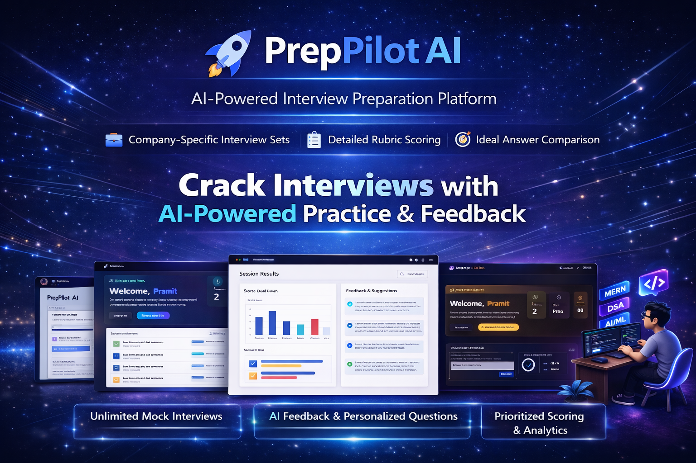
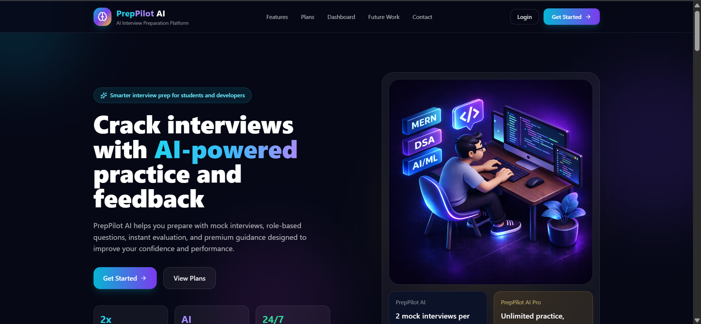
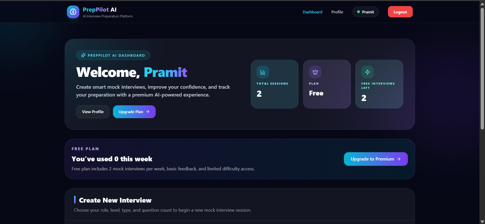
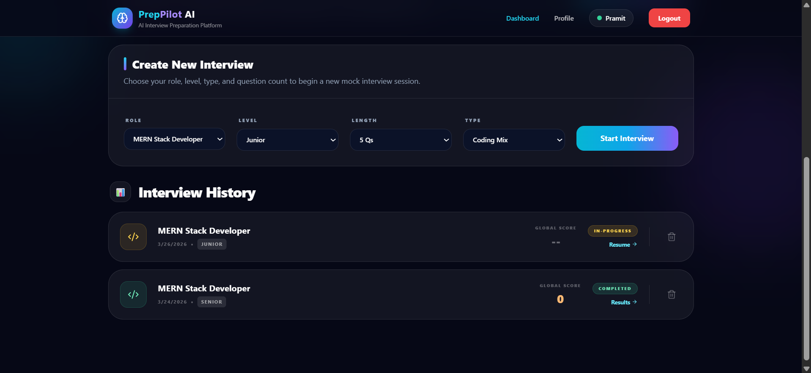
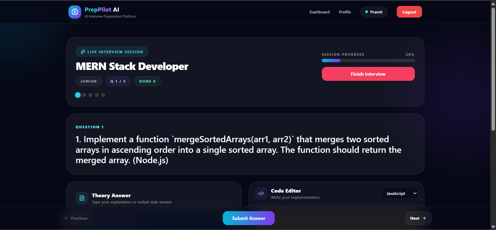
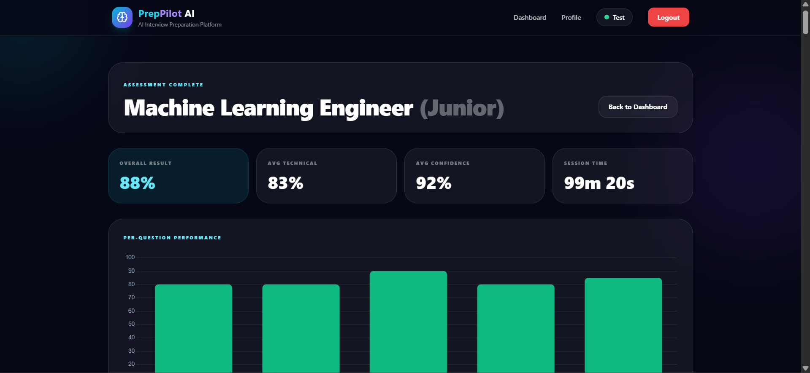
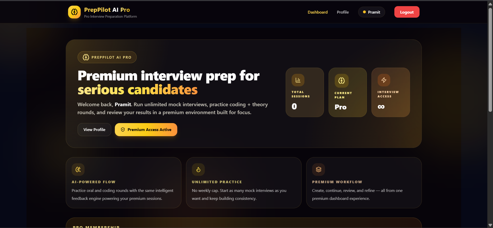

# 🚀 PrepPilot AI

PrepPilot AI is a full-stack MERN-based interview preparation platform designed to help users practice technical interviews with real-time AI-driven evaluation and detailed performance analysis.

The platform provides a realistic interview environment where users can create mock interview sessions, answer questions, and receive structured feedback to improve their skills and confidence.

PrepPilot AI offers both a Free plan and a Premium plan (**PrepPilot AI Pro**) with advanced features and deeper insights.

---

## ✨ Core Features

### 🆓 Free Plan
- 2 mock interviews per week
- Basic AI feedback
- Limited question difficulty
- Standard interview mode
- Limited interview history

### 💎 Premium Plan – PrepPilot AI Pro
- Unlimited mock interviews
- Advanced AI evaluation
- Resume-based personalized questions
- Company-specific interview sets
- Detailed rubric scoring
- Ideal answer comparison (Your Answer vs AI Answer)
- Priority faster AI processing
- Unlimited saved interview history

---

## 🧠 AI-Powered Interview Experience

PrepPilot AI simulates a complete interview workflow:

- Create interview sessions based on role, level, and type  
- Dynamically generate interview questions  
- Practice oral and coding interviews  
- Submit answers directly in the platform  
- Receive AI-powered evaluation  
- Review detailed feedback and performance  

---

## 📊 Advanced Evaluation System

The AI evaluates users using multiple dimensions:

- Communication Skills  
- Problem Solving Ability  
- Code Quality  
- Edge Case Handling  
- Time Complexity  
- Confidence & Clarity  

### 🔍 Additional Insights

- Ideal answer comparison (User vs AI model answer)  
- Missing points detection  
- Improvement suggestions  
- Session-wise performance tracking  

---

## 📄 PDF Report System

PrepPilot AI generates downloadable PDF reports for completed interviews, including:

- Overall score  
- Section-wise rubric scoring  
- Detailed feedback  
- Ideal answer comparison  
- Performance breakdown  

---

## 🏢 Company-Based Interview System

Users can practice interviews tailored to specific companies.  
The system generates relevant question sets based on company-style interview patterns.

---

## ⚙️ Tech Stack

### Frontend
- React.js (Vite)  
- Tailwind CSS  
- Redux Toolkit  
- React Router DOM  
- Axios  
- Socket.io Client  
- Monaco Editor  

### Backend
- Node.js  
- Express.js  
- MongoDB  
- Mongoose  
- JWT Authentication  
- Socket.io  

### Integrations
- Razorpay (Premium Payments)  
- AI Evaluation Engine  
- PDF Generation System  

---

## 🧩 Project Highlights

- Full-stack MERN architecture  
- Separate Free and Premium user flows  
- Real-time updates using WebSockets  
- Secure JWT authentication  
- Advanced AI feedback system  
- Clean modern dark UI  
- Scalable and modular structure  

---

## 👤 User Flow

1. User registers or logs in  
2. Selects role, level, and interview type  
3. Creates a mock interview session  
4. Questions are generated  
5. User submits answers  
6. AI evaluates performance  
7. User views detailed feedback and scores  
8. Premium users access advanced features and reports  

---

## 🔐 Authentication & Access

- Secure login & signup system  
- JWT-based authentication  
- Protected routes  
- Premium feature access control  

---

## 💳 Premium Upgrade

PrepPilot AI includes a Premium upgrade system that unlocks:

- Unlimited interviews  
- Advanced AI evaluation  
- Resume-based questions  
- Company-specific interviews  
- PDF reports  
- Faster processing  

---

## 📸 Screenshots

### 🏠 Home Page


### 📊 Dashboard


### 🎯 Create Interview Session


### 🧠 Interview Interface


### 📈 AI Feedback & Results


### 💎 Premium (PrepPilot AI Pro)


---


## 📁 Project Structure

```bash
PrepPilot-AI/
│
├── frontend/
|	├── main.py
|	├── requirements.txt
|
├── frontend/
│   ├── src/
│   ├── public/
│   └── package.json
│
├── backend/
│   ├── controllers/
│   ├── models/
│   ├── routes/
│   ├── middleware/
│   ├── config/
│   └── server.js
│
└── README.md
```

## 🚀 Getting Started

Clone the repository
```bash
git clone https://github.com/P2786/PrepPilot-AI.git
cd PrepPilot-AI
```
Install dependencies
Frontend
```bash
cd frontend
npm install
```
Backend
```bash
cd ../backend
npm install
```

## Setup environment variables

- Backend .env
```bash
PORT=5000
MONGO_URI=your_mongodb_connection
JWT_SECRET=your_jwt_secret
RAZORPAY_KEY_ID=your_key_id
RAZORPAY_KEY_SECRET=your_key_secret
```

- Frontend .env
```bash
VITE_API_URL=http://localhost:5000/api
VITE_RAZORPAY_KEY_ID=your_key_id
```
## Run the project
# backend
```bash
cd backend
npm run server
```
# frontend
```bash
cd frontend
npm run dev
```

## 🖥️ Local Setup (Windows)

# Project runs locally using:

- Node.js
- MongoDB (Local / Atlas)
- VS Code
- Git

# Example path:
```bash
C:\Users\admin\project\ai-interviewer
```

## 📈 Future Improvements

- Company-specific mock interviews
- Resume-based personalized mock
- Detailed rubric scoring
- Ideal answer comparison
- Downloadable PDF report

# 👨‍💻 Author

Pramit Savaliya

#📜 License

This project is licensed under the MIT License.

# 🌟 About

PrepPilot AI is built for students and developers who want to prepare for interviews in a practical way. It focuses on real experience, AI-driven feedback, and continuous improvement.
